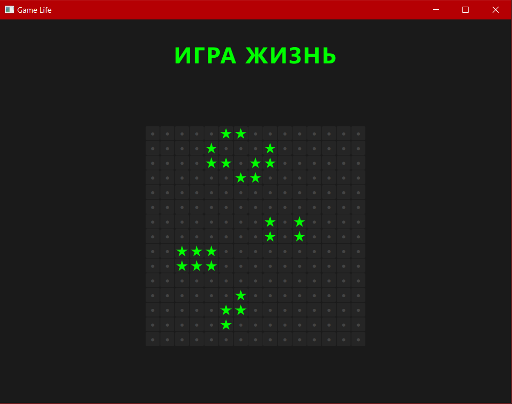

**● Используемая технология/платформа**

Язык программирования: C++ 17.

Фреймворк: Qt 6 (поддерживается и Qt 5.15+).

Архитектура: MVVM.

Платформы: Windows(целевая), Linux, macOS.

  
**● Инструкция по сборке**

Для сборки проекта требуется Qt Creator или CMake.

Сборка через CMake:

Откройте терминал в корневой папке проекта.

Создайте папку для сборки и перейдите в неё: *mkdir build && cd build.*

Запустите конфигурацию: *cmake ..*

    Примечание: Если CMake не находит компилятор MinGW, укажите путь к Qt: cmake .. -G "MinGW Makefiles" -DCMAKE_PREFIX_PATH="<QT_PATH>/6.8.x/
    mingw_64"

    Если ошибка сохраняется, добавьте компилятор в PATH текущей сессии: set PATH=<QT_PATH>\Tools\mingw1310_64\bin;%PATH%

Соберите проект: *cmake --build .*

  
**● Инструкция по запуску**

После успешной сборки запустите исполняемый файл GameLife.exe.

При запуске программа считывает конфигурационный файл game_of_life_input.json.

В интерфейсе отобразится игровое поле. Обновление происходит автоматически каждые (секунда / fps).

По завершении работы результат последнего цикла сохраняется в game_of_life_output.json.

Поддерживается запуск с кастомными путями через флаги: -i и -o.

  
**● Используемые библиотеки**

**STL** - Стандартная библиотека C++, использованная для эффективного управления памятью и хранения данных.

**Qt JSON** - Набор классов (QJsonDocument, QJsonObject) для парсинга JSON данных и преобразования результатов программы.

**Qt Quick Models** - использование QAbstractTableModel для создания связующего звена (ViewModel) между C++ и QML.

**Qt Containers** - Применение структур данных, таких как QHash, для оптимизированной обработки данных для QML.

